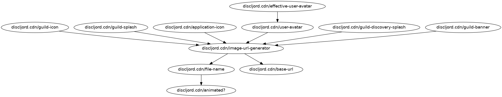

# clj-auto-call-graph

Early and very rough proof-of-concept for automatically generating call graphs
of Clojure code, centered around a given variable/function.

## Options

```
Usage: clj-auto-call-graph [options]

Options:
      --source-paths PATHS                       Comma-separated list of paths to source files for analysis
      --starting-node NODE                       Namespace-qualified definition of starting node. E.g my.ns/my-fn
      --namespace-filters PATHS    clojure.core  Comma-separated list of namespaces to ignore
      --reference-depth DEPTH      1             Depth of graphing for what the starting node references
      --referenced-by-depth DEPTH  1             Depth of graphing for what references the starting node
  -h, --help
```

## Examples

```
lein run --source-paths ../discljord/src/             \
    --starting-node discljord.cdn/image-url-generator \
    --reference-depth 2                               \
    --referenced-by-depth 2
```



## License

Copyright © 2022 Shawn Kinkade

This program and the accompanying materials are made available under the
terms of the Eclipse Public License 2.0 which is available at
http://www.eclipse.org/legal/epl-2.0.

This Source Code may also be made available under the following Secondary
Licenses when the conditions for such availability set forth in the Eclipse
Public License, v. 2.0 are satisfied: GNU General Public License as published by
the Free Software Foundation, either version 2 of the License, or (at your
option) any later version, with the GNU Classpath Exception which is available
at https://www.gnu.org/software/classpath/license.html.
